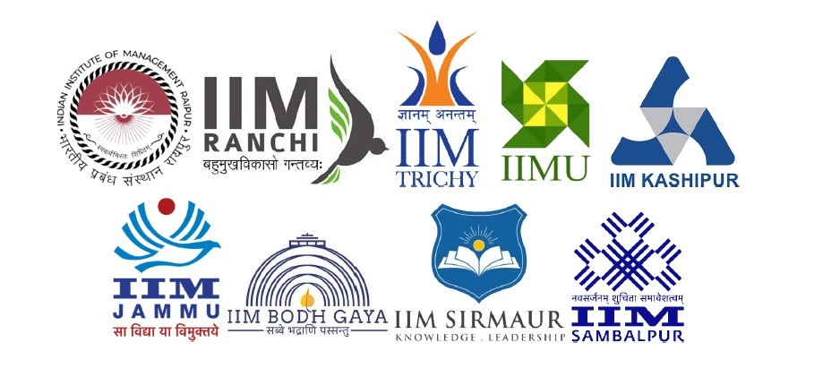
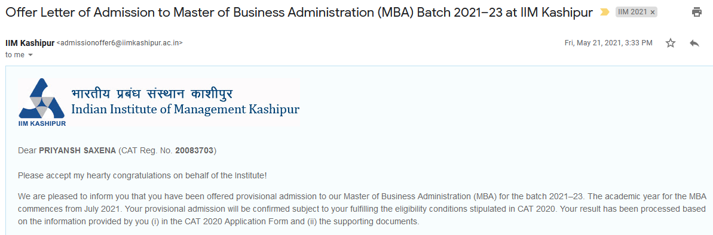
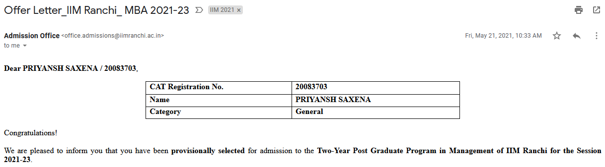

> IIM CAP or the Common Admission Process is a single-window selection process in which the candidates eligible for admission to the nine new IIMs.
>
> The nine CAP participating IIMs are [IIM Bodh Gaya](https://iimbg.ac.in), [IIM Jammu](http://www.iimj.ac.in), [IIM Kashipur](http://www.iimkashipur.ac.in), [IIM Raipur](https://www.iimraipur.ac.in), [IIM Ranchi](https://iimranchi.ac.in), [IIM Sambalpur](https://www.iimsambalpur.ac.in), [IIM Sirmaur](https://www.iimsirmaur.ac.in), [IIM Trichy](https://www.iimtrichy.ac.in) and [IIM Udaipur](https://www.iimu.ac.in).
>
> 

Every year, one of the nine CAP IIMs oversees the CAP. For 2021, CAP was conducted by IIM Raipur.

I had applied for the flagship Post-Graduate Programme (PGP) of all CAP IIMs except Jammu, and some other programmes lik Human Resource Management (PGP-HRM) IIM Trichy and Business Analytics (PGPBA) of IIM Ranchi.

### Before The Interview

IIM Raipur had announced [this shortlisting criteria](https://www.iimraipur.ac.in/pdf/CAP%202021.pdf) for CAP 2021.

The shortlist for WAT-PI was announced in Mid-January, and I was shortlisted for all the eight IIMs I had applied for.

Most CAP IIMs sent out PI Kits for preparation. Some of them even assigned PGP2 students as mentors like the old IIMs.

| IIM | PI Kit | Mentor |
| --- | --- | --- |
| Bodh Gaya| &#9745; | &#9744; |
| Kashipur | &#9745; | &#9744; |
| Raipur | &#9745; | &#9745; |
| Ranchi | &#9744; | &#9744; |
| Sambalpur | &#9745; | &#9744; |
| Sirmaur | &#9744; | &#9744; |
| Trichy | &#9745; | &#9745; |
| Udaipur | &#9745; | &#9745; |

### The Interview

Two panelists - one male around 45-55 and one female around 40-50 years of age. The candidates were expected to join the Zoom meeting-room with their display-names in a specific format. My interview started after nearly half an hour of waiting.

#### What are your responsibilities in your current role ?
Spoke about the ongoing project at work, and explained my role in solving the problem that we worked on. Briefly explained the ecosystem and supporting services that compliment the actual software that we worked on. 

#### How does software help in infrastructure-provisioning ?
Spoke about automation and user-experience tools that improve the productivity of the developers who require some infrastructure for their day-to-day jobs.

#### Do you have any Site Reliability Mechanism in place ?
Explained the logging, monitoring, and whistleblower workflows in place to handle errors, service-downtime, and post-mortems in case of incidents.

#### You've studied at IIT Mandi, right ? Did you work with the CyberSecurity Group ? 
The lady interviewer seemed to know about IIT Mandi, hence the question. I told them that I had worked with researchers from the [MANAS Lab at IIT Mandi](https://manas.iitmandi.ac.in) during my final year project, and not with the CyberSecurity Group.

#### What is Back-Propagation in Deep-Learning ? What is its importance ?
This question arose because from my final-year project. I explained the concept of 'learning' as numbers assigned to various deciding-parameters of a problem, and the auto-correction of those numbers travelling 'back' from the result on a training dataset while learning. The process is a feedback mechanism to tell the algorithm to correct its decision-making process, and hence the importance. 

#### What are your hobbies ? 
I had written about reading in the application-form for CAP. Spoke about genres that I like, but did not talk about the books. Reading is a cliché hobby, and the interviewers didn't want to dig deeper into it - even with my genuine interest. 

#### Did you read today's newspaper ? What's going on ?
Around that time, there was a turmoil going on in the Puducherry Assembly. Spoke about that in 2-3 sentences. I expected it to lead to other questions, but it didn't.

#### Who is Disha Ravi ? Why is she in the news ?
The arrest of Disha Ravi around that time was a popular current-affairs topic. Spoke about it in 2-3 short sentences, and no follow-up questions were asked.

### Impressions and Takeaways

The interview lasted for around 12-13 minutes. The interviewers tried to gauge the extent of my knowledge of the environment that I worked in. They also tried to check whether I was comfortable talking about the basics of the projects that I claimed to have worked upon - another common pattern generally observed in all sorts of interviews.

Overall, CAP was a fairly simple interview. The key takeaway from that was to brush up on commonly known topics from the recent past (2-3 months is a good period, 6-8 months is exceptionally good - you'll rarely get quizzed for events from a year or two back unless they were super-popular), and have a decent understanding of the problem-statements that you have worked on.

> "If you can't explain it to a six year old, you don't understand it yourself." - [Albert Einstein](https://www.goodreads.com/quotes/19421-if-you-can-t-explain-it-to-a-six-year-old)

### The Verdict

Converted all CAP IIMs I had interviewed for!

### Chronology

| Event | Date |
| --- | --- |
| Shortlist announcement | January 15th |
| Interview Schedule Intimation | January 27th 2021 |
| Interview Schedule | February 22nd 2021, 9:30 AM IST onwards |
| Provisional Admission Announcement | May 21st-22nd 2021 |
