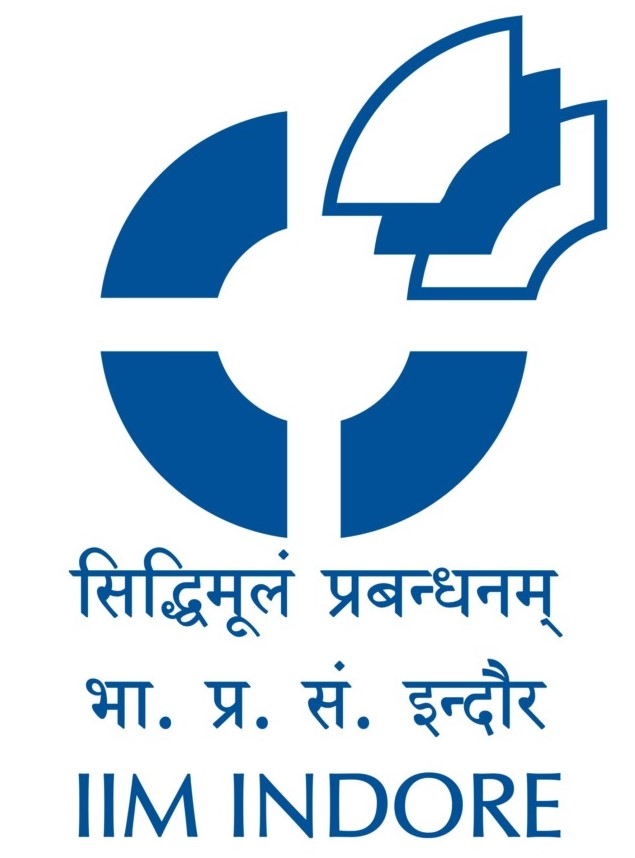

> [Indian Institute of Management Indore](https://www.iimidr.ac.in/) is an autonomous public business school located in Indore, Madhya Pradesh in India. Instituted in 1996, IIM Indore is the sixth addition to the Indian Institute of Management (IIM) family of management schools.
>
> It was named as an institute of national importance in 2017 along with the other IIMs.
>
> 

I had applied for the flagship Post-Graduate Programme (PGP), and the Human Resource Management (PGP-HRM) programmes of IIMI, for the batch of 2021-2023.

### Before The Interview

IIMI had announced [this admission criteria](https://www.iimidr.ac.in/wp-content/uploads/Admissions-Procedure-PGP-2021-23-Batch.pdf) for the batch of 2021-2023.

The shortlist for WAT-PI was announced in Mid-January, and I was shortlisted for both PGP and PGP-HRM.

Unlike most other IIMs, IIM Indore did not assign any mentor or buddy before the interviews. They did not send out any kind of PI Kit, again unlike most IIMs. 

However, unlike most IIMs, they did set up a pre-interview verification on Zoom, to assess the hardware-setup of the candidates for the interviews. As a candidate interviewing from my home, I liked the thought of ensuring that lighting- and hardware-issues do not hinder a candidate's prospects in an online interview. 

### The Interview

Two male panelists - both around 50-60 years of age. The candidates were instructed to join the Zoom meeting-room 15 minutes prior to the interview schedule, and the interview actually started ~10 minutes before the scheduled time.

#### General one-liner questions
Asked for my name, college, branch of engineering, and CGPA.

#### Have you studied Graph Theory ?
Answered in affirmative. When asked about the core-concepts, spoke about the definitions of graphs, trees, nodes, and edges. Also explained the real-life usage of a graph to model the friends of a user on social-media.

#### Do you know about the [Travelling Salesman Problem](https://en.wikipedia.org/wiki/Travelling_salesman_problem) ?
Explained the problem, and spoke in short about a computer-programme I had written in my undergraduate days to get an approximate solution of TSP for some small inputs.

#### Do you know Quicksort ?
Affirmed and explained the algorithm using the concept of a pivot.

#### What is 'runtime' ?
This question was a little confusing. I asked whether they meant complexity, guessing it from the vague description they tried to formulate before saying the word 'runtime'. Once the expectation that the word they were looking for was 'complexity', spoke about the time- and space-complexity of the Quicksort Algorithm. Explained the worst-case scenario. 

#### What is Big-O and Big-Omega notation for complexity ?
This question was self-prompted. In the last question, in explaining the complexities through upper-bound and tight-bound, I had introduced the terms. So I asked if they would like to know about it.

#### What is your job at Goldman Sachs ?
Explained the overall problem-statement and objective of the projects I worked on, and responsibilities specific to me.

#### Why not stay in your current job ? You seem to like it
This is the disguised form of the classic 'Why MBA' question. I told them about my expectations of learning about existing practices, theories, and concepts of business administration, to get a holistic view before taking up a managerial role.

#### You don't want to work, you only want to give 'gyaan' - right ?
I spoke about how managers in my current organization still contribute to technical discussions of their respective fields, illustrating that being a manager doesn't necessarily mean only supervision, guidance or policy-formulation. A manager should act as a bridge between the vision of the organization and the people who help make that vision a reality. I explained how my technical background can help set realistic goals for the business-problems coming from higher up, and identify the scalability and robustness of the solutions developed by the team. All that changes is the description of the work. 

#### What's the difference between a leader and a boss ?
I connected this answer from the numerous motivational LinkedIn articles (like [this](https://www.linkedin.com/pulse/leaders-vs-bosses-key-differences-between-leader-boss-mohit-guglani/)). I spoke about how leaders empathize with the workforce, set up realistic goals, help the people working for them, and build an environment that keeps the workforce motivated. 

### Impressions and Takeaways

The interview lasted for less than 10 minutes. The interviewers apparently didn't have technical background, and focussed on the behavioural aspects.

IIMI gives a very high weightage to past academics, so I expected questions from Computer Science or Software Technology. However, the interviewers didn't take that route, which reiterates the point that interviews can go very different from your expectations, and staying calm, composed and informed is the best you can do.

### The Verdict

Converted!

### Chronology

| Event | Date |
| --- | --- |
| Shortlist announcement | January 16th |
| Pre-Interview Verification | March 5th 2021 |
| Interview Schedule Intimation | March 24th 2021 |
| Interview Schedule | April 6th 2021, 4:00 PM IST onwards |
| Provisional Admission Announcement | May 11th 2021 |
