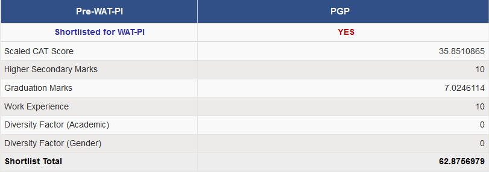
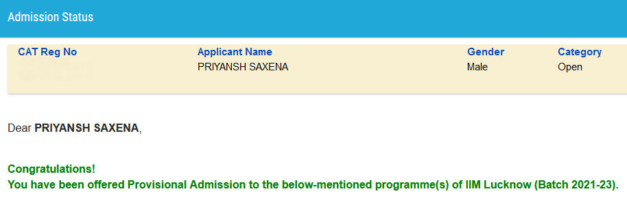
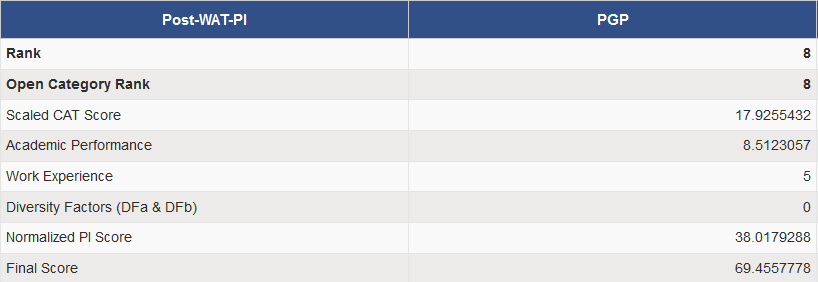

> [Indian Institute of Management Lucknow](https://iiml.ac.in) is a public business school in Lucknow, Uttar Pradesh, India. It was established in 1984 as the fourth Indian Institute of Management (IIM) by the Government of India.
>
> It is recognised as an "Institution of Excellence" by India's Ministry of Human Resource Development, and serves as the mentor institution for IIM Jammu, IIM Rohtak, and IIM Kashipur.
>
> 

I had applied for the flagship Post-Graduate Programme (PGP), and the Sustainable Management (PGP-SM) programmes of IIML, for the batch of 2021-2023. 

### Before The Interview

IIML had announced [this admission criteria](https://www.iiml.ac.in/sites/default/files/upload/news/409065814Admission-Policy-2021-23_280121.pdf) for the batch of 2021-2023.

The shortlist for WAT-PI was announced in Mid-January, and I was shortlisted for both PGP and PGP-SM. While completing the application, I further filtered out PGP-SM, and interviewed only for PGP.

Ignicion, the Mentorship Cell of IIML, assigned a mentor to each shortlisted candidate, for interview-preparation and general discussion about their life at IIML. The mentor assigned to me had a profile quite similar to me, so perhaps your profile is considered while assigning the mentor. They also send out a fat PI-Kit, containing general definitions from different business concerns - HR, Marketing and others - along with interview questions and profile of some candidates.

IIM Lucknow set up a 10-minute document-verification process prior to releasing the personal-interview dates. This is done to superficially verify the information provided in the CAT registration and IIML application.  

### The Interview

Two male panelists - both around 45-55 years of age. The interview on Google Meet started right on time.

#### Tell us about yourself
Spoke about my education and job-responsibilities.

#### What location are you working in ?
Bangalore, spoke about other locations of the firm in India as well.

#### Why do you want to join an MBA Programme ?
One of the most popular questions in an IIM interview. I had given this one a fair bit of thought and had it rehearsed for this very moment.

#### What are `Stock Market`, `Bull Market`, and `Bear Market` ?
Explained the idea of a share, share-trading, rising and falling trends of share-prices.

#### What is the difference between `Equity` and `Debt` ? Which of them has a better return ?
Defined Equity and Debt with examples. I didn't know the in-and-out of the WACC and the CAPM models, and I answered `Equity will yield better results` by simplifying the concept to `Greater the risk, greater the reward!`.

#### What is the difference between `Stock Market` and `Mutual Fund` ?
Explained the concept of stock-bundling in a mutual-fund. Elaborated upon the reduction of risk in a diversified portfolio, and the pros ("safer investment") and cons ("less control over the stocks being traded") of a mutual-fund as compared to the stock-market.

#### What is a Balanced Mutual Fund ?
Struggled with this one.

#### Have you seen this ad of ICICI on TV ? Maybe that will tell you about the Balanced Mutual Fund.
Spoke about how we didn't watch television in the traditional sense, and how ads are practically non-existent in an OTT environment.

#### Explain the term `MidCap`
Spoke about the broad grouping of the values of market-capitalization into small-, mid-, and large-cap categories. Told them that I did not know about the actual values that demarcate the categories.

#### What is an IPO ?
Defined an initial public offering, and simplified the concept with a 2-line example.

#### What are your hobbies ?
Gave them three, ending with Astronomy.

#### Why Astronomy ?
Expressed my interest in star-gazing, and the intriguing laws of physics that govern the cosmic phenomena.

#### What other interview calls do you have ?
Told them about other calls, and that I had appeared for IIMA interview just one day ago.

#### What difference do you see in this interview and that of IIMA ? Describe one thing that you did better today.
Told them about going to a VC Center versus appearing for this one on Google Meet at home was a noticeable difference. Also, IIMA interview focussed on my work-experience as an engineer because of my role, whereas today's interview stayed more on the finance side because of the firm I worked in. Since I had not expressed an explicit interest in Finance in the [Why MBA](#why-do-you-want-to-join-an-mba-programme-), this was somewhat surprising. I described how I handled a question that I didn't know the answer to differently from the IIMA interview.

### Impressions and Takeaways

The interview lasted for a little less than 15 minutes. I kept my answers short and to-the-point. Realized that general awareness of the concepts helps not only in making a sound business-decision, but also in personal-life.

From my point-of-view, the interviewers probably tried to explore my curiosity in the business-side of the organization I was working in. Perhaps looking for the inquisitiveness and the ability to socialize with people from other domains as well. The most important takeaway was to not beat about the bush, and keep the answer short and simple, to not lose the interviewers' attention.

### The Verdict

Converted!

### Chronology

| Event | Date |
| --- | --- |
| Shortlist announcement | January 15th |
| Document Verification | February 18th 2021 |
| Interview Schedule Intimation | February 19th 2021 |
| Interview Schedule | February 27th 2021, 2:00 PM - 3:30 PM IST |
| Provisional Admission Announcement | May 20th 2021 |
