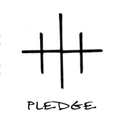
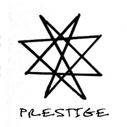

> _"Google LLC is"_ ... 
> 
> Well, you know what Google is - chances are, you have landed here after searching for "Google Interview Experience" on Google itself!
>
> As an individual, I was awed by the extent to which Google services permeate our day-to-day life. As a software engineer, I was fascinated by the speed and scale at which those services operate. I always wondered what it would be like to actually work at Google. And now that it's no longer just a day-dream, I'd like to share my journey on the road to Google.    

_Disclaimer: This article is intended to serve as a peep into the hiring process, and does not contain actual interview questions._

And without further ado, let's get to the point.

|  |
| ------------------- |
|_"People came here for a fight - let's give them what they came for!" - Joey Tribbiani_|

---

## How did it all start ?

I was referred to Google by a friend towards the end of February. I shook off the procrastination dragging me back in a week and started to devote more time to preparation in the second week of March - curating the resume, locating the right roles on [Google Careers](https://careers.google.com), and problem-solving. The efforts started yielding results pretty soon - I got the mail from a recruiter the very next day of finishing off the application process, the last week of March.

The recruiter gave me an overview of the process, what to expect in the interviews, and we agreed upon a month's time to prepare before the telephonic screening. I received a bunch of resources to seek help from. We decided to touch base after a month's time to decide upon the interview's dates.

This is where the differences in the hiring process started to be more pronounced. The first noticeable difference was the attention given to the level of preparation of the candidate. You are given sufficient time to prepare, the recruiter takes an active interest in how your preparation is shaping up, and only after you are confident does the recruiter schedule your interviews.

> _Every great magic trick consists of three parts or acts._


## Telephonic-Screening: The Pledge



> _The magician shows you something ordinary: a deck of cards, a bird or a man_

The telephonic-screening lasts for 45 minutes. The interviewer would take the first 5 minutes for introduction. Then, you are given a problem-statement. At this point, you take charge of the interview, and the interviewer helps you by answering your questions to define the scope of the problem and the expected outcome.

The telephonic-screening round was scheduled in the first week of May. I was presented a problem that used a 2D array of integers as input to yield an integer output. I took 5 minutes to add two test-cases and calculate the answers for them by hand, then described a solution and coded it out in the next 30 minutes. In the last 5 minutes, the interviewer asked me to add some error-handling, and we discussed the time- and space-complexity of the algorithm. Finally, the interviewer asked me if we could reduce the space used by the algorithm. After a short discussion, I realized that while the Big-O complexity would not change, we could actually reduce the space to some extent.

I felt that the interview was ["not great, not terrible"](https://www.youtube.com/watch?v=Mg5HOnq7zD0). And then came the feedback discussion call from the recruiter the next day!

The interview had gone worse than I had estimated. We discussed the options - take the screening round again, or see if this performance would be good enough to secure an onsite-interview call. The risk of moving ahead with less firepower than might be needed was spooky. I left the decision to the recruiter. All the prep-work that I had put in for the last month seemed to have fallen short. The stories of people failing to get past the screening round echoed in the back of my mind. It was a glum evening.

The next day, I received an email from the recruiter - we were going ahead for the onsite interviews. ["The Game, Mrs Hudson, is on!"](https://www.youtube.com/watch?v=M-KqaO1oH2E) was the first thought in my mind.

## The Interim Phase: The Turn


> _The magician takes the ordinary something and makes it do something extraordinary._

Having realized that there are shortcomings, I intensified my preparation. More questions on Leetcode, more reading, more revision - I started scouring my problem-solving skills, one topic at a time. The accuracy on Leetcode started to take a hit, as I attempted harder questions in a stricter time-frame. I kept a notebook of handy tricks that I encountered. Revisited some concepts from the college days. Stole some time away from my loved ones, and snatched some more out of nap-time.

The de-motivation that sets in after a setback can make or break an individual. With the help of my well-wishers and friends, it became easier to fight back against the grimness of the situation. The flexible hiring process of Google immensely helped with it, and it was accentuated far more clearly by an exceptionally helpful recruiter.

By the fourth week of May, I had enough safety nets to fall back on - both academic and professional. There were 200+ medium and hard questions in the kitty as well. After 12 consecutive days of solving 2 Leetcode medium-level questions under 40 minutes, I consulted the recruiter. We decided to go through all the interviews in two consecutive days, in the first week of June.

It's time for the final showdown!

---

## The Onsite Interviews: The Prestige



> _You want to be fooled. But you wouldn't clap yet. That's why every magic trick has a third act, the hardest part._

No amount of preparation would have calmed my nerves after the last mauling. However, it was soothing to know that I had more armour on now than before.

The interviews began.

The first round started out differently - I was asked some math questions. It put me at ease, until one brain-fade had me use a tip from the interviewer. "Déjà vu! That's gonna hurt bad." I thought, but prodded on nevertheless. The problem came, and the problem was solved. While demonstrating the correctness of the solution for an input, another calculation-error had the interviewer intervene, but this one didn't feel so bad.

__"Well, that didn't go as well as I had planned."__

And that's where all the preparation and practice threw its weight behind me! Subsequent interviews went better than the first. The dynamic-programming, the searching-sorting, the divide-and-conquer - I saw them coming, and wasn't entirely baffled by them. I asked questions to make sure I was solving the correct problem. I leveraged all the experience from the prep-phase to code out routines. I talked to the interviewers to explain my intention behind each line of the code. The Googley-ness round - a 30-minute non-technical discussion to assess the non-engineering skills of the candidate - had questions from actual scenarios I had encountered.

At the end of all the interviews, I spoke to my Googler friends. Recounted the experience to them, and made sure that I had ticked each of the boxes which they had advised me about. Discussed with them the possibility of conversion. Spent some time revisiting the problems to see if I had missed something. I felt at ease after each discussion. I actually felt hopeful!

---

## The Verdict

The wait couldn't have been longer! I wrung my hands every morning, anticipating a call - maybe an SMS. Kept refreshing my inbox every half-an-hour, searching through all the junk for that one glint of gold. The exit formalities from the previous employment kept my mind off things, but there's only so much that you can suppress.

And then, it happened.

It was June 16<sup>th</sup>. There was a phone call. There was an affirmation. There was a supreme effort of not jumping up in the air with delight, lest the headphones should fall off!

|  |
| --- |
| _"I am the King of the World!"_ |

---

## The Aftermath

With the complications of my timeline, the recruiter sped up the process that happens after the Hiring Committee at Google okays a candidate. Once again, the incredible attention to detail, and the employee-centric attitude of Google helped me breeze through the process.

The aftermath actually has a lot more exciting stuff that would make you want to join Google even more (if free food isn't enough reason). However, that's a story that resonates more with those who clear the high-bar of Google interviews. So if you're in the preparation phase right now, this is where I take your leave. The last part of this story, and a lot of behind-the-scenes action awaits you at the point where you become a Noogler! 

---

## FAQs - because there always are!


Here are some of the questions that pretty much every one has asked me about the process.

### How long does the entire process take ?

It varies from person to person. Typically, it can take 2-4 months for the hiring to get completed.

### What is the duration of an interview ?

Generally, 45 minutes - give or take 5 minutes - for the technical rounds. The Googley-ness round takes 30 minutes.

### How many questions should I expect in each interview ?

What defines a question can change the answer here. In one of my interviews, the interviewer added a total of 8 questions - most of which were one-liner. Expect 1-2 problems to be thrown your way.

### How many questions should I solve before the interviews ?

Depends upon your practice and problem-solving acumen. I solved 720 questions on Leetcode before the onsite interviews.

### What is the difficulty level of the problems ?

Expect problems similar to the ones marked medium to hard on Leetcode. There's no rule of thumb, but you can skip the hardest medium-level questions if you're short on prep-time. Nearly 50% of the problems I solved during my preparation were of medium difficulty.

### Should I expect any language-specific questions ?

The interviewer would expect you to know about the words that you're typing. While you may not be asked about the system-calls that are triggered when an ```if-condition``` is evaluated, you can expect to be asked to differentiate between an ```ArrayList``` and ```LinkedList```.

### Are the interviews stressful ?

Not in the least! The interviewers are very patient. If you get stuck, they ask you questions which will guide you in the right direction. They will help you out with the test-cases, and the dry-runs too. It's more like a technical discussion than an interview.

### What data-structures and algorithms are the most important ?

Every concept is important! For data-structures, you should have a good grasp of arrays, linked-lists, graphs, trees, stacks, and queues. In algorithms, try to cover binary-search, greedy, dynamic-programming, mathematical analysis, two-pointers, and dfs-bfs. Remember, the more concepts you practice, the less likely you are to face a question that stumps you.

### Did you feel overwhelmed during the prep-phase at any point ?

Most certainly! The journey you've embarked upon is full of ups-and-downs. There will be phases where some problems will appear to be unsolvable. As long as you enjoy solving each problem you face, and take some learning out of each one of them, these phases will get spaced further apart.

### How do I find roles that are suitable for me ?

Visit [Google Careers](https://careers.google.com), plug in your preferences, and let Google do the work - they know how to search and find the best results for you!
